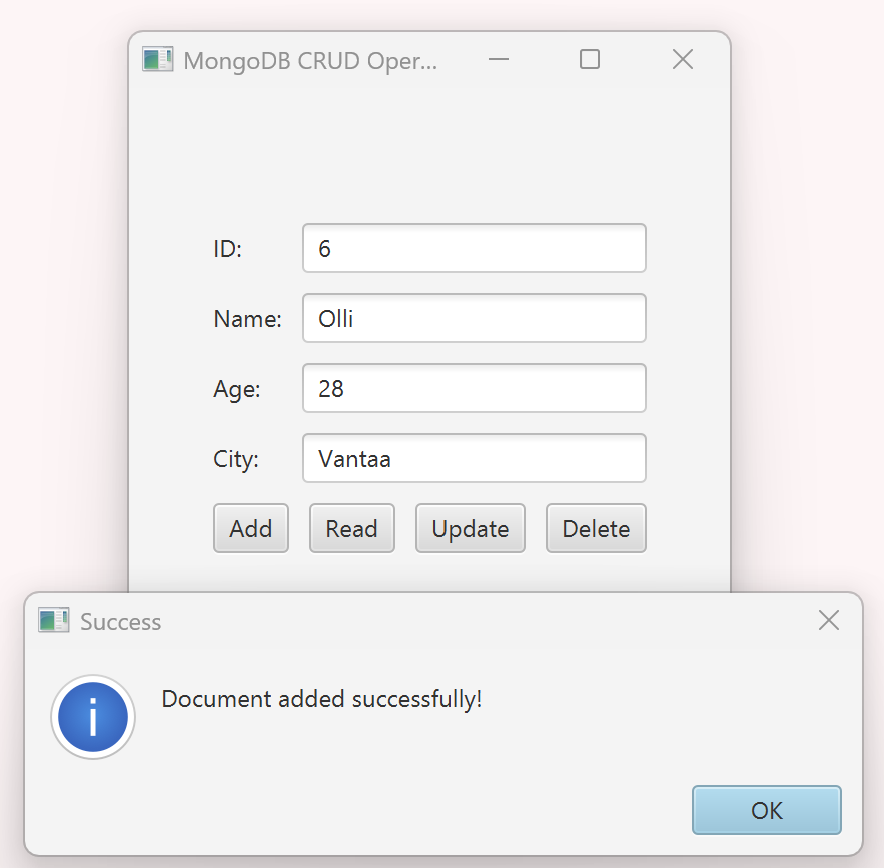
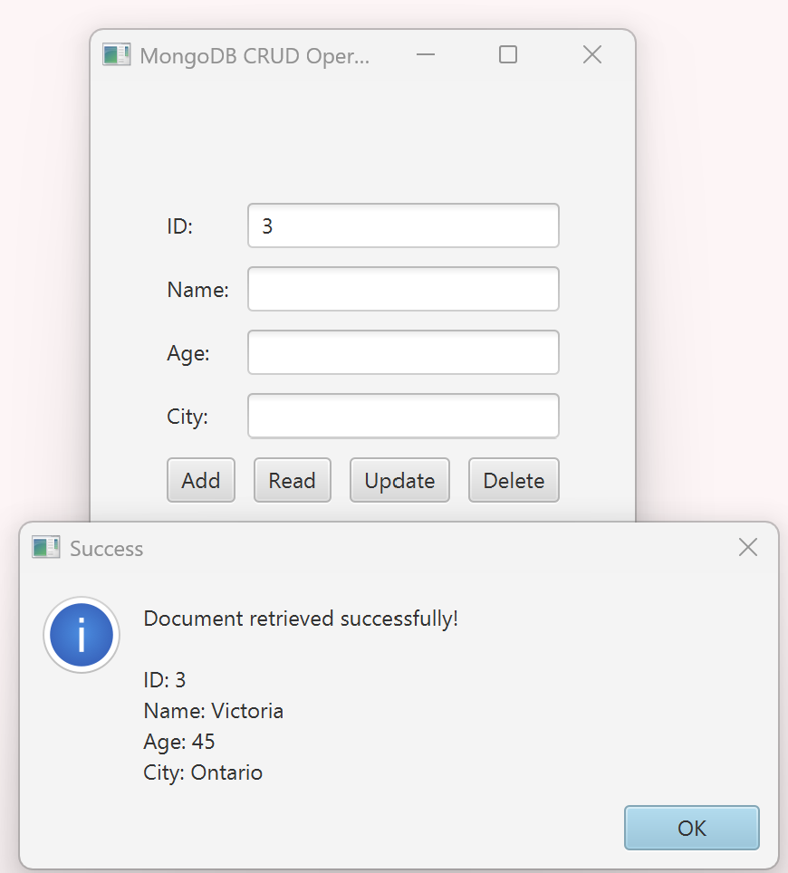
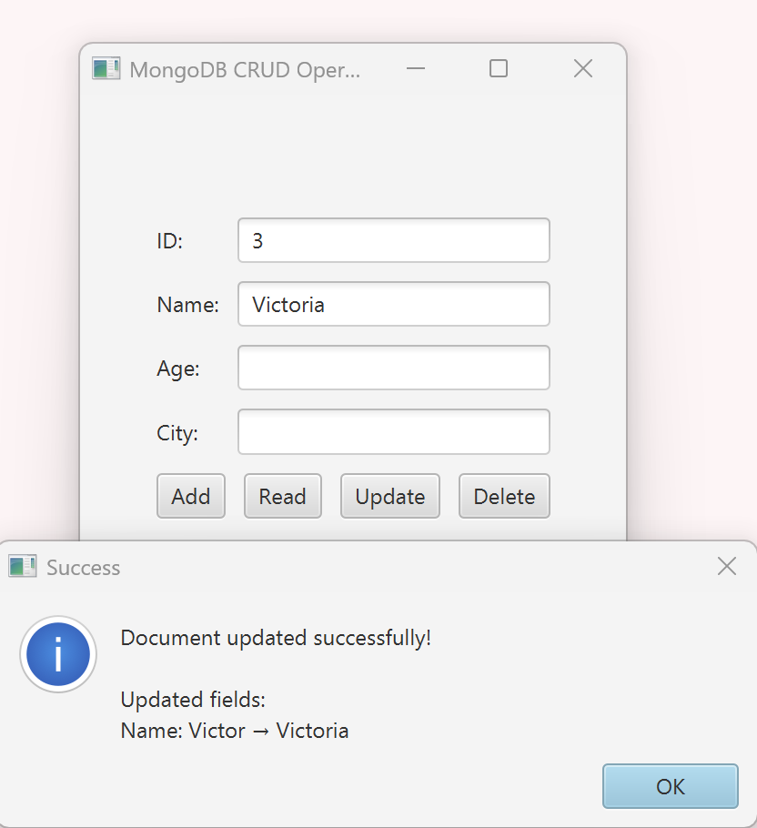
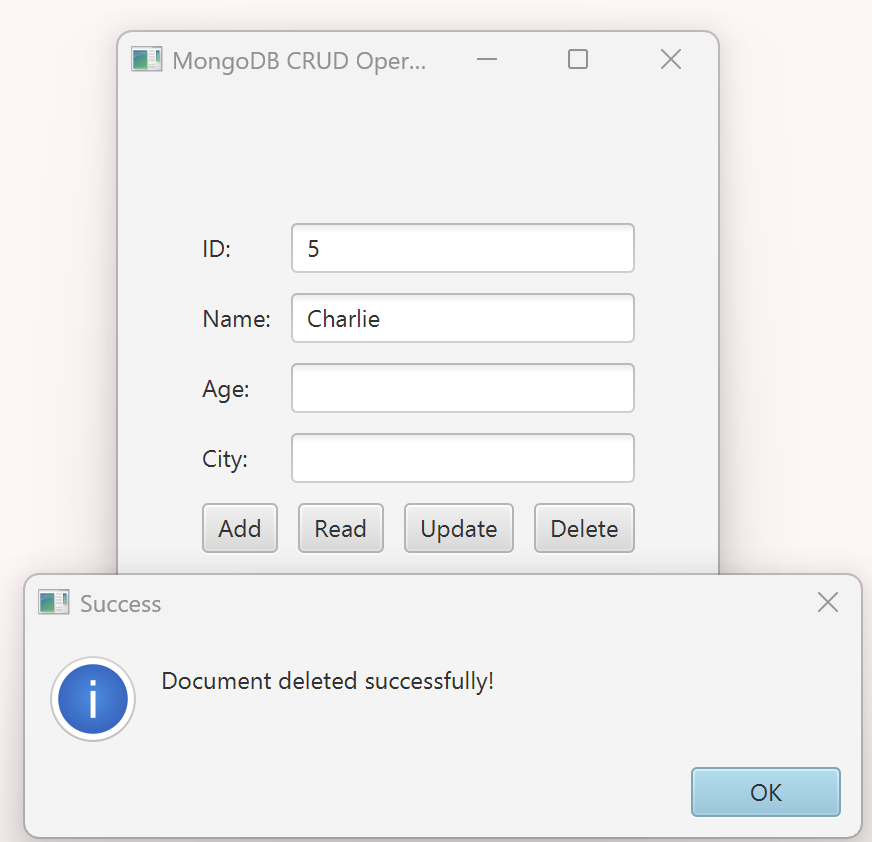
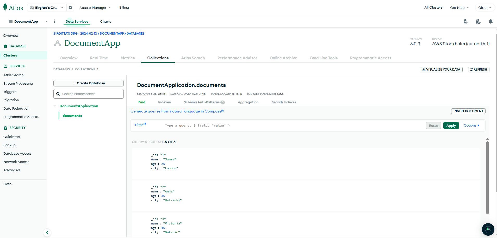

# MongoDB CRUD Application with JavaFX

This project demonstrates a CRUD (Create, Read, Update, Delete) application using JavaFX for the frontend and MongoDB as the database. The application allows you to manage a collection of documents stored in a MongoDB database with operations like adding, reading, updating, and deleting records.

## Features

1. **Add a New Document**: Adds a document with details like ID, Name, Age, and City to the database.
2. **Read a Document**: Fetches a document from the database using the provided ID.
3. **Update a Document**: Updates the details of an existing document in the database.
4. **Delete a Document**: Deletes a document from the database using the provided ID.

## Getting Started

### Prerequisites

- Java Development Kit (JDK) 21 or later.
- MongoDB Atlas account or a locally running MongoDB server.
- IntelliJ IDEA or another Java IDE.
- JavaFX dependencies in the `pom.xml` file.

## Folder Structure
Below is the folder structure of the `DemoWithMongoDB` project:

```
DemoWithMongoDB
│   .env
│   .gitignore
│   pom.xml
├───src
│   ├───main
│   │   ├───java
│   │   │   └───org.example.demowithmongodb
│   │   │       ├───DocumentApplication.java
│   │   │       ├───DocumentController.java
│   │   │       └───MongoDBConnection.java
│   │   ├───resources
│   │   │   ├───images
│   │   │   └───org.example.demowithmongodb
│   │   │       └───document-view.fxml
```

### Cloning the Repository

1. Clone this repository using the following command:
   ```bash
   git clone https://github.com/gitober/DemoWithMongoDB.git

### Setup

2. Create a `.env` file in the project root and add the following configurations to connect to your MongoDB instance:
   ```
   MONGO_URI=your_cluster_uri
   MONGO_DATABASE=your_database_name
   ```

## How to Use

### Add Operation

The `Add` button inserts a new document into the database. Provide the details in the text fields and click `Add`.



### Read Operation

The `Read` button retrieves a document from the database using the provided ID. The details are shown in an alert message.



### Update Operation

The `Update` button updates specific fields of a document in the database. Input the ID of the document you want to update and fill in the fields you want to modify.



### Delete Operation

The `Delete` button deletes a document from the database using the provided ID. Input the ID and click `Delete`.



### MongoDB Database

An example of a MongoDB database cluster in MongoDB Atlas.



## Technologies Used

- **JavaFX**: For the GUI interface.
- **MongoDB**: For the database.
- **Java**: For backend logic and MongoDB integration.

## Logging and Alerts

- The application uses SLF4J for logging operations.
- Alerts are used for success and error messages for better user interaction.
